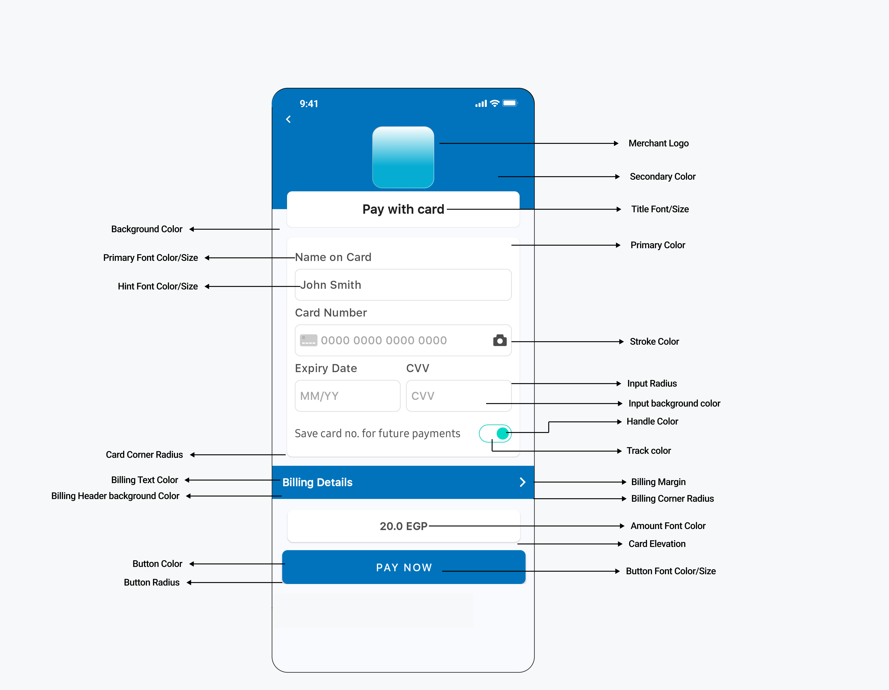

Clickpay android library sample
========

## Requirements

- compileSdkVersion 35
- targetSdkVersion 35 Library requires at minimum Java 8 or Android 5.1.

--------

## Install

You have to include the following dependencies:

```
    implementation 'sa.com.clickpay:payment-sdk:6.7.1'
```

Proguard
--------
If you are using ProGuard you might need to exclude the library classes.

```java
-keep

public class com.payment.paymentsdk.**{*}
```

Pay now (in Kotlin)
--------

```kotlin
val profileId = "PROFILE_ID"
val serverKey = "SERVER_KEY"
val clientLey = "CLIENT_KEY"
val locale = PaymentSdkLanguageCode.EN or PaymentSdkLanguageCode.AR
val screenTitle = "Test SDK"
val cartId = "123456"
val cartDesc = "cart description"
val currency = "AED"
val amount = 20.0

val tokeniseType = PaymentSdkTokenise.NONE // tokenise is off
or PaymentSdkTokenise . USER_OPTIONAL // tokenise if optional as per user approval
        or PaymentSdkTokenise . USER_MANDATORY // tokenise is forced as per user approval
        or PaymentSdkTokenise . MERCHANT_MANDATORY // tokenise is forced without user approval

val transType = PaymentSdkTransactionType.SALE
or PaymentSdkTransactionType . AUTH


val tokenFormat = PaymentSdkTokenFormat.Hex32Format()
or PaymentSdkTokenFormat . NoneFormat ()
or PaymentSdkTokenFormat . AlphaNum20Format ()
or PaymentSdkTokenFormat . Digit22Format ()
or PaymentSdkTokenFormat . Digit16Format ()
or PaymentSdkTokenFormat . AlphaNum32Format ()

val billingData = PaymentSdkBillingDetails(
    "City",
    "2 digit iso Country code",
    "email1@domain.com",
    "name ",
    "phone", "state",
    "address street", "zip"
)

val shippingData = PaymentSdkShippingDetails(
    "City",
    "2 digit iso Country code",
    "email1@domain.com",
    "name ",
    "phone", "state",
    "address street", "zip"
)
val configData = PaymentSdkConfigBuilder(profileId, serverKey, clientKey, amount ?: 0.0, currency)
    .setCartDescription(cartDesc)
    .setLanguageCode(locale)
    .setMerchantIcon(resources.getDrawable(R.drawable.bt_ic_amex))
    .setBillingData(billingData)
    .setMerchantCountryCode("AE") // ISO alpha 2
    .setShippingData(shippingData)
    .setCartId(orderId)
    .setTransactionType(transType)
    .showBillingInfo(false)
    .showShippingInfo(true)
    .forceShippingInfo(true)
    .setScreenTitle(screenTitle)
    .build()
startCardPayment(this, configData, callback = this)
or
startSamsungPayment(this, configData, "samsungpay token", callback = this)

override fun onError(error: PaymentSdkError) {
    Log.d(TAG, "onError: $error")
    Toast.makeText(this, "${error.msg}", Toast.LENGTH_SHORT).show()
}

override fun onPaymentFinish(PaymentSdkTransactionDetails: PaymentSdkTransactionDetails) {
    Toast.makeText(
        this,
        "${paymentSdkTransactionDetails.paymentResult?.responseMessage}",
        Toast.LENGTH_SHORT
    ).show()
    Log.d(TAG, "onPaymentFinish: $paymentSdkTransactionDetails")

}

override fun onPaymentCancel() {
    Toast.makeText(this, "Cancelled", Toast.LENGTH_SHORT).show()
    Log.d(TAG, "onPaymentCancel:")

}

```

3.You are now ready to start payment

* For normal card payment use:

```
startCardPayment(context = this, ptConfigData = configData, callback = this)
```


* For recurring payment use:

```Kotlin
startTokenizedCardPayment(
    context = this,
    ptConfigData = configData,
    token = yourToken,
    transactionRef = yourTransactionReference,
    callback = this
)
```

* For recurring payment with 3DS feature enabled (request CVV) use:

```Kotlin
start3DSecureTokenizedCardPayment(
    context = this,
    ptConfigData = configData,
    savedCardInfo = PaymentSDKSavedCardInfo("Masked card", "Visa or MC or card type"),
    token = token!!,
    callback = this
)
```


* For recurring payment with the ability to let SDK save Cards on your behalf and show sheet of
  saved cards for user to choose from. use:

```Kotlin
startPaymentWithSavedCards(
    context = this,
    ptConfigData = configData,
    support3DS = true,
    callback = this
)
```


## Query transaction

You can check the status of a transaction

1- first create PaymentSDKQueryConfiguration

```Kotlin
val queryConfig = PaymentSDKQueryConfiguration(
    "ServerKey",
    "ClientKey",
    "Country Iso 2",
    "Profile Id",
    "Transaction Reference"
)
```

2- Call QuerySdkActivity.queryTransaction and pass the needed arguments

```Kotlin
QuerySdkActivity.queryTransaction(
    this,
    queryConfig,
    this
)
```

Pay now (in Java)
--------

```java
String profileId="PROFILE_ID";
        String serverKey="SERVER_KEY";
        String clientKey="CLIENT_KEY";
        PaymentSdkLanguageCode locale=PaymentSdkLanguageCode.EN;
        String screenTitle="Test SDK";
        String cartId="123456";
        String cartDesc="cart description";
        String currency="AED";
        double amount=20.0;

        PaymentSdkTokenise tokeniseType=PaymentSdkTokenise.NONE; // tokenise is off
        or PaymentSdkTokenise.USER_OPTIONAL // tokenise if optional as per user approval
        or PaymentSdkTokenise.USER_MANDATORY // tokenise is forced as per user approval
        or PaymentSdkTokenise.MERCHANT_MANDATORY // tokenise is forced without user approval

        PaymentSdkTransactionType transType=PaymentSdkTransactionType.SALE;
        or PaymentSdkTransactionType.AUTH


        PaymentSdkTokenFormat tokenFormat=new PaymentSdkTokenFormat.Hex32Format();
        or new PaymentSdkTokenFormat.NoneFormat()
        or new PaymentSdkTokenFormat.AlphaNum20Format()
        or new PaymentSdkTokenFormat.Digit22Format()
        or new PaymentSdkTokenFormat.Digit16Format()
        or new PaymentSdkTokenFormat.AlphaNum32Format()

        PaymentSdkBillingDetails billingData=new PaymentSdkBillingDetails(
        "City",
        "2 digit iso Country code",
        "email1@domain.com",
        "name ",
        "phone","state",
        "address street","zip"
        );

        PaymentSdkShippingDetails shippingData=new PaymentSdkShippingDetails(
        "City",
        "2 digit iso Country code",
        "email1@domain.com",
        "name ",
        "phone","state",
        "address street","zip"
        );
        PaymentSdkConfigurationDetails configData=new PaymentSdkConfigBuilder(profileId,serverKey,clientKey,amount,currency)
        .setCartDescription(cartDesc)
        .setLanguageCode(locale)
        .setBillingData(billingData)
        .setMerchantCountryCode("AE") // ISO alpha 2
        .setShippingData(shippingData)
        .setCartId(cartId)
        .setTransactionType(transType)
        .showBillingInfo(false)
        .showShippingInfo(true)
        .forceShippingInfo(true)
        .setScreenTitle(screenTitle)
        .build();
        PaymentSdkActivity.startCardPayment(this,configData,this);

@Override
public void onError(@NotNull PaymentSdkError paymentSdkError){

        }

@Override
public void onPaymentCancel(){

        }

@Override
public void onPaymentFinish(@NotNull PaymentSdkTransactionDetails paymentSdkTransactionDetails){

        }
```

You are now ready to start payment

* For normal card payment use:

```Java
PaymentSdkActivity.startCardPayment(
        this,
        configData,
        this);
```

* For recurring payment use:

```Java
PaymentSdkActivity.startTokenizedCardPayment(
        this,
        configData,
        "Token",
        "TransactionRef",
        this);
```

* For recurring payment with 3DS feature enabled (request CVV) use:

```Java
PaymentSdkActivity.start3DSecureTokenizedCardPayment(
        this,
        configData,
        new PaymentSDKSavedCardInfo("Masked card","Visa or MC or card type"),
        "Token",
        this);
```

## Tokenisation

To enable tokenisation please follow the below instructions

```kotlin
 // to request token and transaction reference pass tokeniseType and Format
.setTokenise(PaymentSdkTokenise.MERCHANT_MANDATORY, PaymentSdkTokenFormat.Hex32Format())
    // you will receive token and reference after the first transaction       
    // to pass the token and transaction reference returned from sdk 
    .setTokenisationData(token = "", transactionReference = "") 
```

## SamsungPay

1. To enable pay with samsungpay you need first to integrate with SamsungPay api. Here how you can
   integrate with SamsungPay Api.
   [SamsungPay Integration Guide](https://github.com/clickpaysa/clickpay-android-library-sample/blob/master/samsung_pay.md)
   .

2. Pass the returned json token from samsung pay to the following method.

```kotlin
startSamsungPayment(this, configData, "samsungpay token", callback = this)
```

## Pay with Alternative Payment Methods

It becomes easy to integrate with other payment methods in your region like STCPay, OmanNet, KNet,
Valu, Fawry, UnionPay, and Meeza, to serve a large sector of customers.

1. Do the steps 1 and 2 from **Pay with Card**
2. Choose one or more of the payment methods you want to support

```kotlin
.setAlternativePaymentMethods(listOf<PaymentSdkApms>()) // add the Payment Methods you want to the list
```

3. Call `startAlternativePaymentMethod` to start payment

```kotlin
PaymentSdkActivity.startAlternativePaymentMethods(context, configuration, callback)
```

## Card Approval

The Payment SDK allows you to customize BIN-based discounts through the `PaymentSdkCardApproval`
class, which collects approval details via an API.

### Example Usage

```kotlin
val cardApproval = PaymentSdkCardApproval(
    validationUrl = "Your validation URL. Ex: https://yourdomain.com/validate",
    binLength = 8,
    blockIfNoResponse = false
)

val configData = PaymentSdkConfigBuilder(profileId, serverKey, clientKey, amount ?: 0.0, currency)
    .setCardApproval(cardApproval)
    .build()
```

- **`validationUrl`**: The endpoint provided by the business where the Payment SDK will pass
  transaction information and receive a response.
- **`binLength`**: The length of the BIN (default is 6 digits, can be set to 8).
- **`blockIfNoResponse`**: Determines whether to block the transaction if there is no response from
  the validation endpoint.

## Card Discount

To apply a discount on a card payment, use the following method:

```kotlin
// List of card discounts
val cardDiscount = listOf(
    PaymentSdkCardDiscount(
        // List of card prefixes from 4 to 10 digits
        listOf("40001"),
        // Discount percentage or value
        10.0,
        // Discount description
        "● 10% discount on VISA cards starting with 40001",
        // Discount type: percentage or value
        true
    )
)
...setCardDiscount(cardDiscount)
```

## Overriding Resources

### Overriding Fonts

Add your custom font files with the following names:

- `payment_sdk_primary_font.tff`
- `payment_sdk_secondary_font.tff`

### Overriding Strings, Colors, or Dimens

To override strings, colors, or dimens, add the resource you need to override from the resources
below:



#### Example of Overriding Colors and Dimens:

```xml

<resources>
    <!-- Override colors -->
    <color name="payment_sdk_primary_color">#ffffff</color>
    <color name="payment_sdk_secondary_color">#0073bc</color>
    <color name="payment_sdk_status_bar_color">#444647</color>
    <color name="payment_sdk_primary_font_color">#4c4c4c</color>
    <color name="payment_sdk_secondary_font_color">#0073bc</color>
    <color name="payment_sdk_hint_font_color">#a5a5a5</color>
    <color name="payment_sdk_stroke_color">#e1e1e1</color>
    <color name="payment_sdk_button_text_color">#FFF</color>
    <color name="payment_sdk_title_text_color">#1e1e1e</color>
    <color name="payment_sdk_button_background_color">#0073bc</color>
    <color name="payment_sdk_background_color">#F9FAFD</color>
    <color name="payment_sdk_blue_F2FAFD">#F2FAFD</color>
    <color name="payment_sdk_error_text_color">#EC2213</color>
    <color name="payment_sdk_back_black_dim">#4D6E6E6E</color>
    <color name="payment_sdk_input_field_background_color">#FFFFFFFF</color>
    <color name="payment_sdk_enabled_switch_track_color">#00000000</color>
    <color name="payment_sdk_enabled_switch_handle_color">#3db39e</color>
    <color name="payment_sdk_disabled_switch_track_color">#00000000</color>
    <color name="payment_sdk_disabled_switch_handle_color">#c7c7c7</color>
    <color name="payment_sdk_switch_stroke_color">#4c4c4c</color>
    <color name="payment_sdk_amount_font_color">#4c4c4c</color>
    <color name="payment_sdk_original_amount_font_color">#a5a5a5</color>
    <color name="payment_sdk_billing_header_background_color">#0073bc</color>
    <color name="payment_sdk_billing_text_color">#FFF</color>

    <!-- Override dimens -->
    <dimen name="payment_sdk_title_font_size">18sp</dimen>
    <dimen name="payment_sdk_title_margin">24dp</dimen>
    <dimen name="payment_sdk_primary_font_size">16sp</dimen>
    <dimen name="payment_sdk_secondary_font_size">16sp</dimen>
    <dimen name="payment_sdk_button_font_size">16sp</dimen>
    <dimen name="payment_sdk_separator_thickness">1dp</dimen>
    <dimen name="payment_sdk_stroke_thickness">.5dp</dimen>
    <dimen name="payment_sdk_input_corner_radius">8dp</dimen>
    <dimen name="payment_sdk_card_corner_radius">8dp</dimen>
    <dimen name="payment_sdk_card_margin">16dp</dimen>
    <dimen name="payment_sdk_billing_header_corner_radius">0dp</dimen>
    <dimen name="payment_sdk_billing_header_margin">0dp</dimen>
    <dimen name="payment_sdk_button_corner_radius">8dp</dimen>
    <dimen name="payment_sdk_error_font_size">12sp</dimen>
    <dimen name="payment_sdk_amount_font_size">16sp</dimen>

    <!-- Override styles -->
    <style name="PaymentSdkTheme" parent="Theme.MaterialComponents.NoActionBar">
        <!-- Hides the payment screen title background -->
        <item name="payment_sdk_hideScreenTitleBackground">true</item>
        <!-- Sets the alignment of the payment screen title [start-end-center] -->
        <item name="payment_sdk_screenTitleAlignment">start</item>
        <!-- Hides the card and button shadows -->
        <item name="payment_sdk_hideViewsShadow">true</item>
    </style>
</resources>
```

## Known Coroutine issue

Please in case you faced dependency conflict with the coroutine api add the following in your app
gradle file.

  ```groovy
configurations.all {
    resolutionStrategy {
        exclude group: "org.jetbrains.kotlinx", module: "kotlinx-coroutines-debug"
    }
}
```

## See the common issues from here

[common issues](https://github.com/clickpaysa/clickpay-android-library-sample/blob/main/common_issues.md)

## Notes

1- Please configure the IPN to avoid loosing any of the transaction status.


## License

See [LICENSE][license].

## ClickPay

[Support][1] | [Terms of Use][2] | [Privacy Policy][3]

 [1]: https://clickpay.freshdesk.com/en/support/solutions
 [2]: https://clickpay.com.sa/wps/portal/clickPay/clickpay/footerpages/termsandconditions
 [3]: https://clickpay.com.sa/wps/portal/clickPay/clickpay/footerpages/privacy
 [license]: https://github.com/clickpaysa/clickpay-ios-library-sample/blob/main/LICENSE

